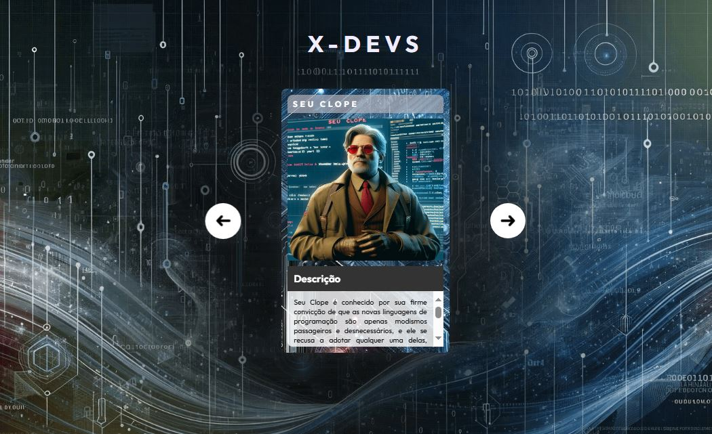

# Projeto X Devs
Este é um projeto feito no evento "Do Zero ao Programador" da Dev em Dobro, que durou de 03 á 09 de Junho de 2024. O projeto mostra uma página da web com uma lista de cartões de personagens fictícios bem estilizados que são mostrados um de cada vez. Clicando nas setas, avançamos para o próximo cartão ou voltamos para o anterior.

## Tabela de Conteúdo
- [Feito com](#feito-com)
- [Screenshot](#screenshot)
- [Versão Live](#versão-live)
- [Onde me Encontrar](#onde-me-encontrar)

### Feito com:
- HTML5
- CSS
- JavaScript
- [VSCode](https://code.visualstudio.com/)
- [Google Fonts](https://fonts.google.com/)
  - Fonte Utilizada: [Outfit](https://fonts.google.com/specimen/Outfit).

### Screenshot

### Versão Live
Veja e interaja com a versão live do site [aqui](https://silo30.github.io/projeto-xdevs/)

### Onde me Encontrar

- LinkedIn - [Silo de Menezes](www.linkedin.com/in/silo-menezes-648920197)
- Frontend Mentor - [Silo30](https://www.frontendmentor.io/profile/Silo30)
- Github - [Silo30](https://github.com/Silo30)
